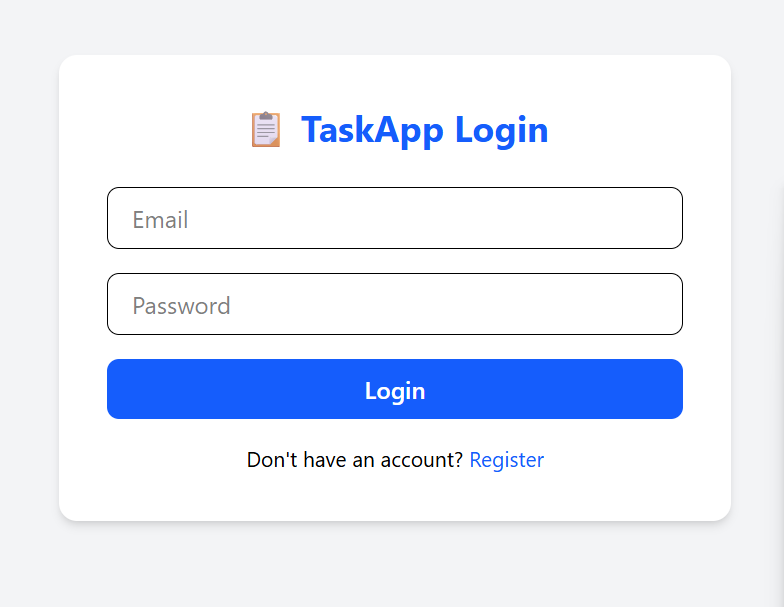
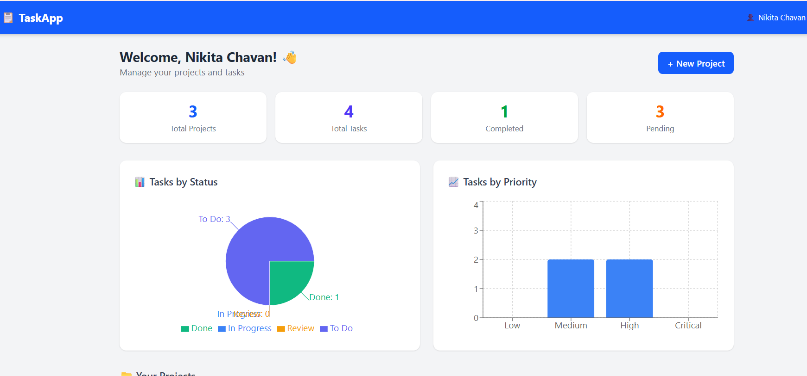
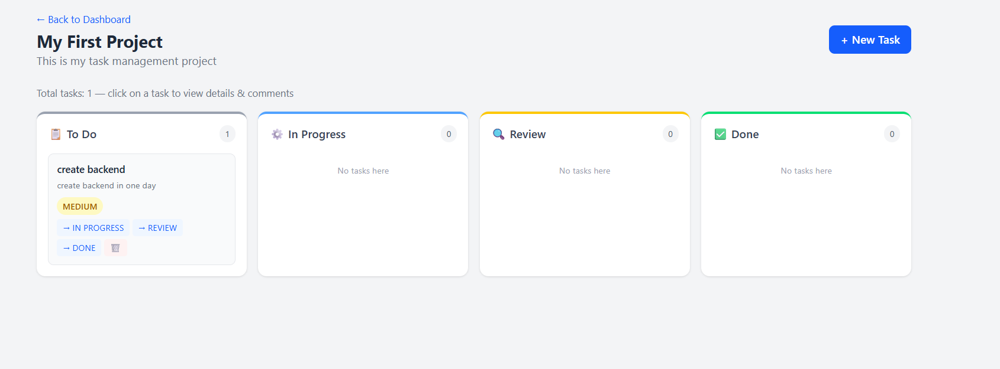
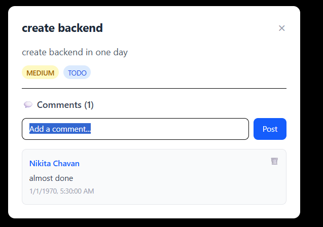

# 📋 Task Management System

A full stack Task Management web application similar to Trello, built with React.js and Spring Boot featuring Kanban board, JWT authentication, and analytics dashboard.

## 🚀 Features

- JWT Authentication (Register & Login)
- Kanban Board (TODO → IN PROGRESS → REVIEW → DONE)
- Dashboard with Pie & Bar Charts
- Comment System on Tasks
- Task Priority Management (LOW, MEDIUM, HIGH, CRITICAL)
- Role Based Access Control (ADMIN, MANAGER, MEMBER)
- Responsive Design

## 🛠️ Tech Stack

| Layer | Technology |
|---|---|
| Frontend | React.js, Vite, Tailwind CSS, Recharts |
| Backend | Spring Boot, Spring Security, JWT |
| Database | MySQL, Spring Data JPA |
| Auth | JWT Token Based Authentication |

## 📁 Repository Structure

Task-Management-System/
├── Backend/       # Spring Boot REST API
├── Frontend/      # React.js Web App
└── Screenshots/   # App Screenshots

## 📸 Screenshots

### Login

### Dashboard

### Kanban Board

### Comments

## 🔗 Setup

### Backend
1. Open Backend folder in IntelliJ
2. Create MySQL database: taskmanagement_db
3. Update application.properties with your MySQL password
4. Run the Spring Boot application

### Frontend
1. Open Frontend folder in VS Code
2. Run: npm install
3. Run: npm run dev
4. Open: http://localhost:5173

## 👩‍💻 Developer

Srushti Chavan
- GitHub: https://github.com/srushtichavan73
- LinkedIn: https://linkedin.com/in/srushti-chavan-7a3283380
